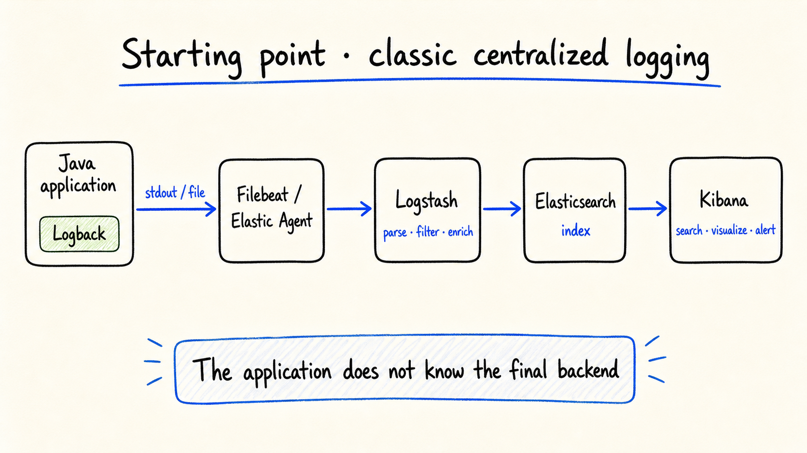
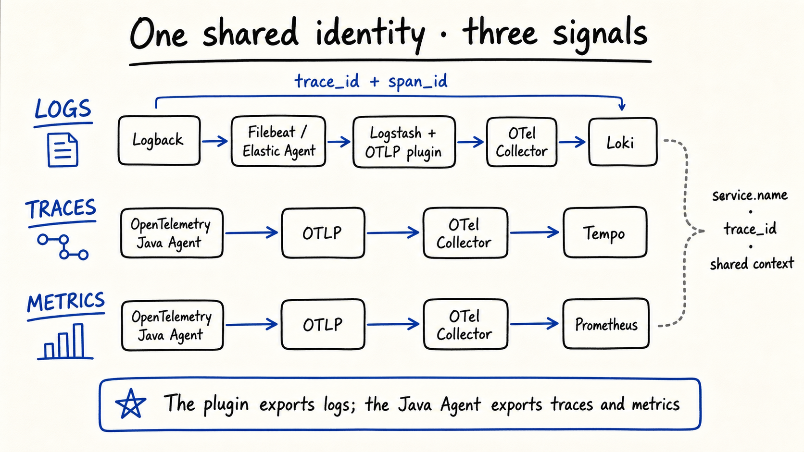
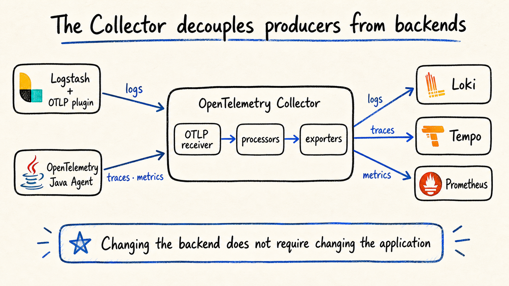
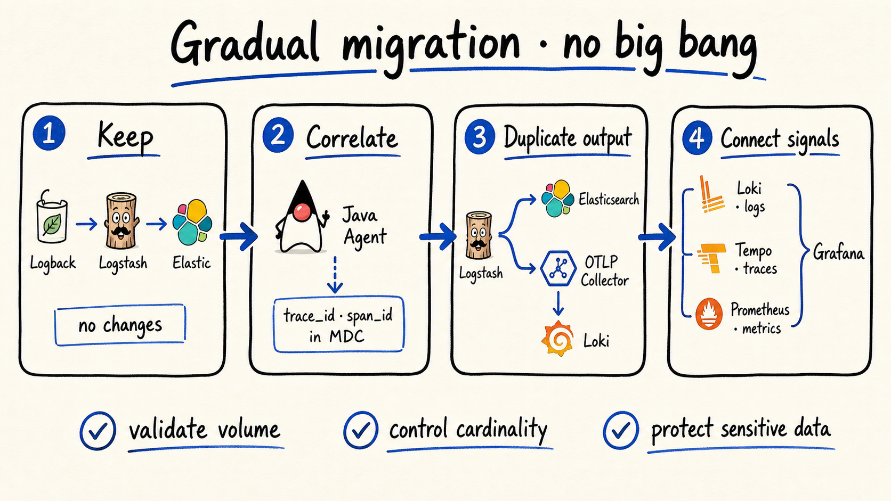

# De Logback y Elastic a OpenTelemetry: Logstash como puente OTLP

## Cómo conectar logs, trazas y métricas sin reescribir las aplicaciones Java

Muchas plataformas Java centralizan sus logs con una arquitectura conocida:



Logback escribe en `stdout` o en un archivo. Filebeat o Elastic Agent recolecta el evento, Logstash lo transforma, Elasticsearch lo indexa y Kibana permite buscarlo.

El modelo funciona, pero aparece una separación cuando se incorpora el OpenTelemetry Java Agent:

- trazas y métricas salen por OTLP;
- los logs siguen viajando por Logback y Logstash;
- el contexto de una misma petición termina repartido entre plataformas.

`logstash-output-otlp` cierra esa brecha: toma el evento procesado por Logstash, lo convierte en un `LogRecord` OTLP y lo envía a un OpenTelemetry Collector.

## Una identidad compartida



El plugin exporta **logs**. El Java Agent continúa exportando **trazas y métricas**. La correlación funciona porque las tres señales comparten:

- `service.name`;
- `trace.id`;
- `span.id`;
- ambiente, versión e identidad de Kubernetes.

El Java Agent puede inyectar `trace.id` y `span.id` en el MDC de Logback. El formato del log debe conservarlos:

```json
{
  "@timestamp": "2026-07-27T14:50:15.922Z",
  "log.level": "WARN",
  "message": "El pago excedió el tiempo esperado",
  "service.name": "payments-api",
  "trace.id": "5b8aa5a2d2c872e8321cf37308d69df2",
  "span.id": "051581bf3cb55c13"
}
```

Si Filebeat o los filtros de Logstash eliminan estos campos, la correlación se pierde.

## Instalar y configurar el plugin

```bash
bin/logstash-plugin install logstash-output-otlp
```

Durante la transición, Logstash puede conservar Elasticsearch y añadir OTLP como segunda salida:

```ruby
input {
  beats {
    port => 5044
  }
}

output {
  elasticsearch {
    hosts => ["https://elasticsearch:9200"]
    index => "application-logs-%{+YYYY.MM.dd}"
    user => "${ELASTIC_USER}"
    password => "${ELASTIC_PASSWORD}"
    ssl_enabled => true
    ssl_certificate_authorities => ["/etc/logstash/certs/elastic-ca.crt"]
  }

  otlp {
    endpoint => "https://otel-collector:4317"
    protocol => "grpc"
    compression => "gzip"
    ssl_certificate_authorities => "/etc/logstash/certs/otel-ca.crt"

    body => "message"
    severity_text => "[log][level]"
    trace_id => "trace.id"
    span_id => "span.id"

    resource => {
      "service.name" => "payments-api"
      "deployment.environment.name" => "production"
    }
  }
}
```

Antes de activar OTLP conviene inspeccionar un evento real con `stdout { codec => rubydebug }` y confirmar los nombres de los campos.

## El Collector como frontera neutral



El Collector desacopla productores y destinos:

- logs de Logstash → Loki;
- trazas del Java Agent → Tempo;
- métricas del Java Agent → Prometheus.

Una configuración mínima puede separar las señales así:

```yaml
receivers:
  otlp:
    protocols:
      grpc:
        endpoint: 0.0.0.0:4317

processors:
  memory_limiter:
    check_interval: 1s
    limit_mib: 512
  batch: {}

exporters:
  otlphttp/loki:
    endpoint: http://loki:3100/otlp
  otlp/tempo:
    endpoint: tempo:4317
    tls:
      insecure: true
  prometheusremotewrite:
    endpoint: http://prometheus:9090/api/v1/write

service:
  pipelines:
    logs:
      receivers: [otlp]
      processors: [memory_limiter, batch]
      exporters: [otlphttp/loki]
    traces:
      receivers: [otlp]
      processors: [memory_limiter, batch]
      exporters: [otlp/tempo]
    metrics:
      receivers: [otlp]
      processors: [memory_limiter, batch]
      exporters: [prometheusremotewrite]
```

Los endpoints, TLS y mecanismos de autenticación deben adaptarse al entorno.

## De un log a una traza

Con el contexto preservado, el recorrido en Grafana es directo:

```text
alerta en Prometheus
→ servicio afectado
→ log en Loki
→ trace.id
→ traza completa en Tempo
```

`trace.id` no debería convertirse en una etiqueta indexada de Loki: su cardinalidad es muy alta. Es mejor conservarlo como metadata estructurada o campo consultable.

## Migrar sin un “big bang”



1. **Conservar:** mantener Elastic mientras se valida el flujo actual.
2. **Correlacionar:** inyectar `trace.id` y `span.id` en el MDC.
3. **Duplicar:** añadir la salida OTLP junto a Elasticsearch.
4. **Conectar:** consultar logs, trazas y métricas desde Grafana.

Durante la convivencia se debe comparar volumen, timestamps, severidad, atributos y comportamiento ante fallos.

## Consideraciones de producción

- Usar TLS y verificar la CA del Collector.
- No habilitar `ssl_disable_tls_verification`.
- Definir una lista explícita de atributos para evitar datos sensibles.
- Aplicar redacción y filtros también en el Collector.
- Habilitar persistent queues si se requiere tolerar interrupciones.
- Supervisar reintentos, descartes y presión de memoria.
- Fijar versiones y digests de las imágenes.

La meta no es reemplazar Elastic de inmediato. Es aprovechar el pipeline existente y convertir Logstash en una vía de adopción gradual hacia OTLP, Loki, Tempo, Prometheus u otros backends compatibles.
